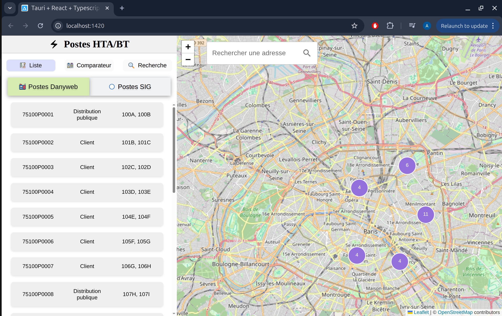
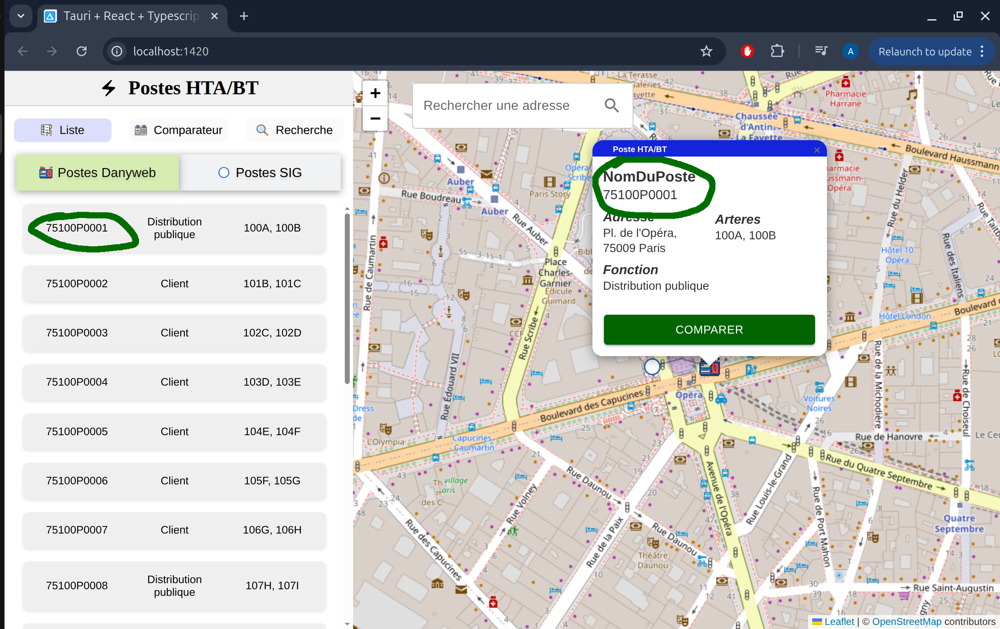
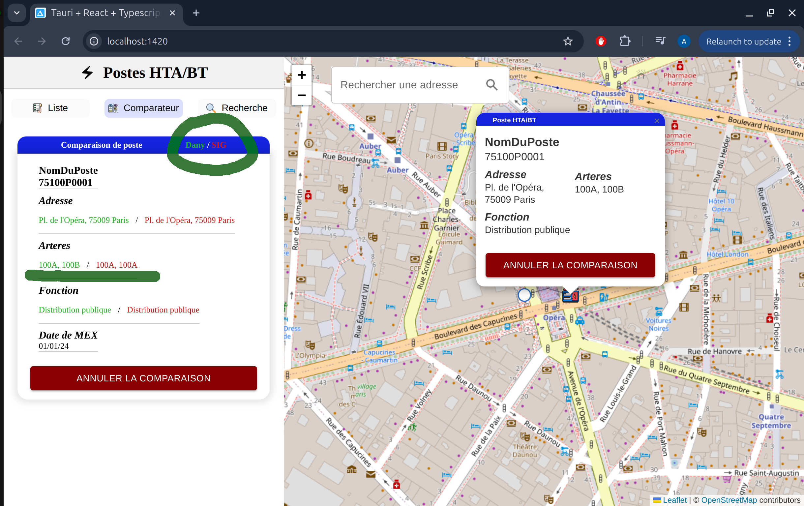
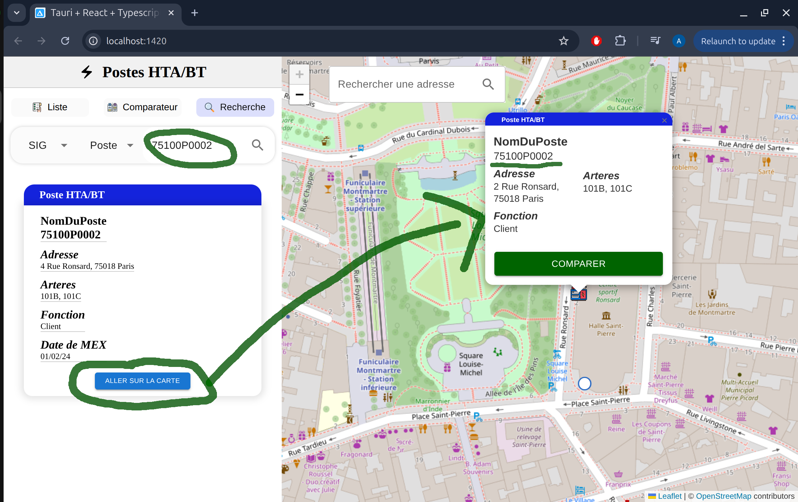
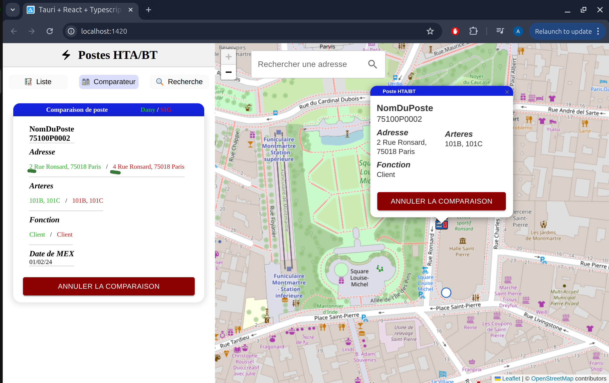
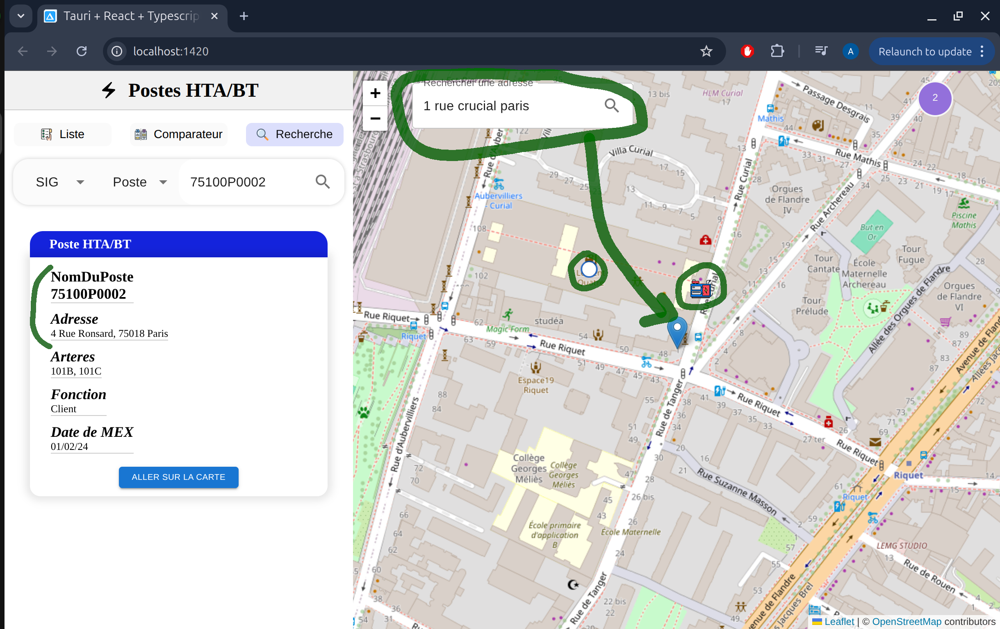

# Delta-GIS : React cross-platform App

Delta-GIS is an application designed for comparing and validating data consistency between a working electrical reference system and a real-time network operations system.\
The project was developed to meet the operational needs of database managers and network operators who frequently face discrepancies between different information systems.

## 🎯 Why this project?
Existing tools for performing these checks are outdated, unintuitive, and often unsuited to real operational needs.\
Delta-GIS offers a modern, portable, and fast solution to facilitate the database managers work.

### ✨ Features

🔎 Automatic comparison between electrical substations (from heterogeneous sources)\
🗺️ Map visualization with Leaflet\
📂 File import (CSV / JSON) from both systems\
⚙️ Geocoding using the French government Address API Enables quick address search and conversion of addresses to geographic coordinates based on multiple criteria\
✅ Inconsistency highlighting: missing data, duplicates, inconsistencies

## 📷 Demo

### Video Demo
<video controls width="550">
  <source src="./src/assets/screens/Screencast.webm" type="video/webm" />
</video>

### Overview Hompage


### From the click to the list, zoom in map electrical transformer and compare data from the 2 sources
 

### Find the electrical transformers by ID and compare data from the 2 sources
 

### Geocoding an address to find an electrical transformer around



## 🚀 Installation & Local Development

```bash
git clone https://github.com/TonydLazuto/delta-gis.git
cd delta-gis
npm clean install
npm run dev
⚠️ Requires Node.js ≥ 18 (pnpm recommended)
```

## 🛠️ How to Build it => [Build Guide](BUILD.md)

### 📂 Project Structure

src\
┣ 📁assets\
┣ 📁components\
┣ 📁interfaces\
┣ 📁stores\
┣ 📁styles\
┗ 📁utils\

### 🖥️ Tech Stack

- **Frontend** : React, TypeScript
- **Build (local)** : Tauri
- **Main libraries** : Leaflet, Zustand
- **Styling** : Sass/Scss

### Known issues

- *Naming*: Mixed use of French and English in codebase
- *Interfaces*: Too many redundant or similar interfaces
- *Cards*: Card designs are duplicated instead of using reusable components

## 📈 Future Goals

🚫 Exclude identical electrical transformer data from comparisons (to avoid unnecessary checks).
🏗️ Detect and track resolved inconsistencies between electrical transformers, with progress indicators.
📊 Display weekly statistics using charts and diagrams.
🔗 Extend comparison to include not only cables but also topological continuity.

## Nota Bene
- Originally, this project started as a basic Leaflet prototype => [Leaflet-init-project](https://github.com/TonydLazuto/Leaflet-test/).\
The Tauri integration came later as the project evolved.
- The project was initially presented via this (fr) document => [Presentation](https://gamma.app/docs/Lapplication-pour-la-Gestion-des-Ecarts-de-Postes-i5addgtgjehnuu5?mode=doc)